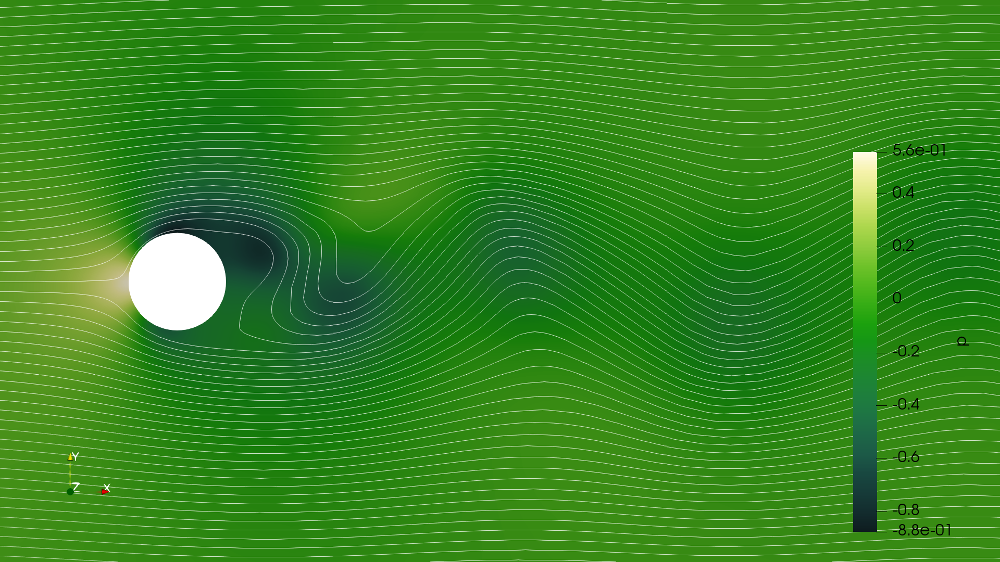

Aim: simulate the turbulent flow past a cylinder in OpenFOAM and parallise with Parareal.

Steps:
1. Follow the [tutorial](https://wiki.openfoam.com/Vortex_shedding_by_Joel_Guerrero_2D) at [Wolf Dynamics](http://www.wolfdynamics.com/wiki/T5_2D_cylinder.pdf), supplementary material: [vortex_shedding.tar.gz](http://www.wolfdynamics.com/wiki/vortex_shedding.tar.gz).
2. Run tutorial straight from Python using pyFOAM.
3. Run parallel-in-time using Parareal in Python with Noodles.



To install the requirements, also clone [ParaNoodles](https://github.com/ParallelWindfarms/paranoodles) and run `pip install .` from its project root. To install additional requirements, have OpenFOAM installed and:

```shell
pip install -r requirements.txt
```

## PyFOAM

PyFOAM is not so well documented. For our application we'd like to do two things: modify the run-directory and run `icoFoam`. We'll start with the following modules:

- `PyFoam.Execution`
- `PyFoam.RunDictionary`
- `PyFoam.LogAnalysis`

The PyFAOM module comes with a lot of tools to analyse the logs that are being created so fanatically by the solvers.

### Running `elbow` example

To run the "elbow" example:

``` {.python #elbow-example}
from PyFoam.Execution.AnalyzedRunner import AnalyzedRunner
from PyFoam.LogAnalysis.StandardLogAnalyzer import StandardLogAnalyzer
```

The `AnalyzedRunner` runs a command and sends the results to an `Analyzer` object, all found in the `PyFoam.LogAnalysis` module, in this case the `StandardLogAnalyzer`.

``` {.python session=0}
import numpy as np
from pathlib import Path
from pintFoam.utils import pushd

path = Path("./elbow").absolute()
solver = "icoFoam"

with pushd(path):
    run = AnalyzedRunner(StandardLogAnalyzer(), argv=[solver], silent=True)
    run.start()
```

### Get results

All access to files goes through the `PyFoam.RunDictionary` submodule.

``` {.python session=0}
from PyFoam.RunDictionary.SolutionDirectory import SolutionDirectory
dire = SolutionDirectory(path)
```

Query for the time slices,

``` {.python session=0}
dire.times
```

And read some result data,

``` {.python session=0 clip-output=4}
p = dire[10]['p'].getContent()['internalField']
np.array(p.val)
```

### Clear results

``` {.python session=0}
dire.clearResults()
```

### Change integration interval and time step

We'll now access the `controlDict` file.

``` {.python session=0}
from PyFoam.RunDictionary.ParsedParameterFile import ParsedParameterFile
controlDict = ParsedParameterFile(dire.controlDict())
controlDict.content
```

change the end time

``` {.python session=0}
controlDict['endTime'] = 20
controlDict.writeFile()
```

# Interface with ParaNoodles

We need to define the following:

* `Vector`
* fine `Solution`
* coarse `Solution`
* coarsening operator
* refinement operator (interpolation)

The last two steps will require the use of the `mapFields` utility in OpenFOAM and may require some tweaking to work out.

``` {.python file=pintFoam/model.py}
<<pintfoam-vector>>
<<pintfoam-solution>>
```

## Vector

The abstract `Vector` representing any single state in the simulation consists of a `RunDirectory` and a time-frame.

``` {.python #pintfoam-vector}
 
```

# Appendix A: Utils

``` {.python file=pintFoam/utils.py}
<<push-dir>>
```

## `pushd`

I haven't been able (with simple attempts) to run a case outside the definition directory. Similar to the `pushd` bash command, I define a little utility in Python:

``` {.python #push-dir}
import os
from pathlib import Path
from contextlib import contextmanager

@contextmanager
def pushd(path):
    """Context manager to change directory to given path,
    and get back to current dir at exit."""
    prev = Path.cwd()
    os.chdir(path)
    
    try:
        yield
    finally:
        os.chdir(prev)
```


